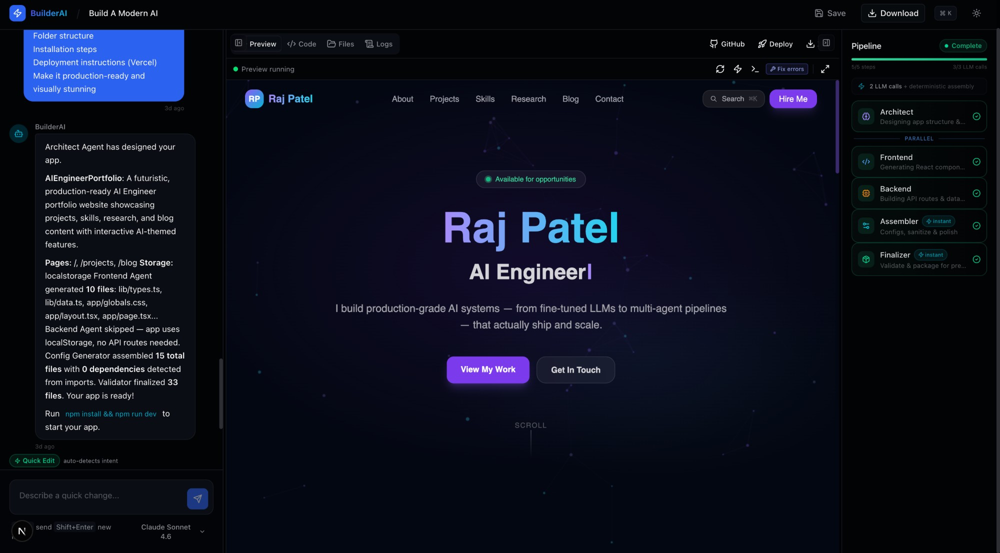
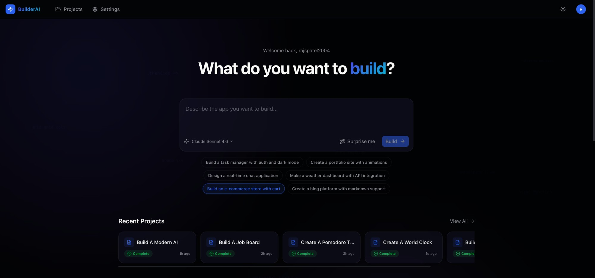
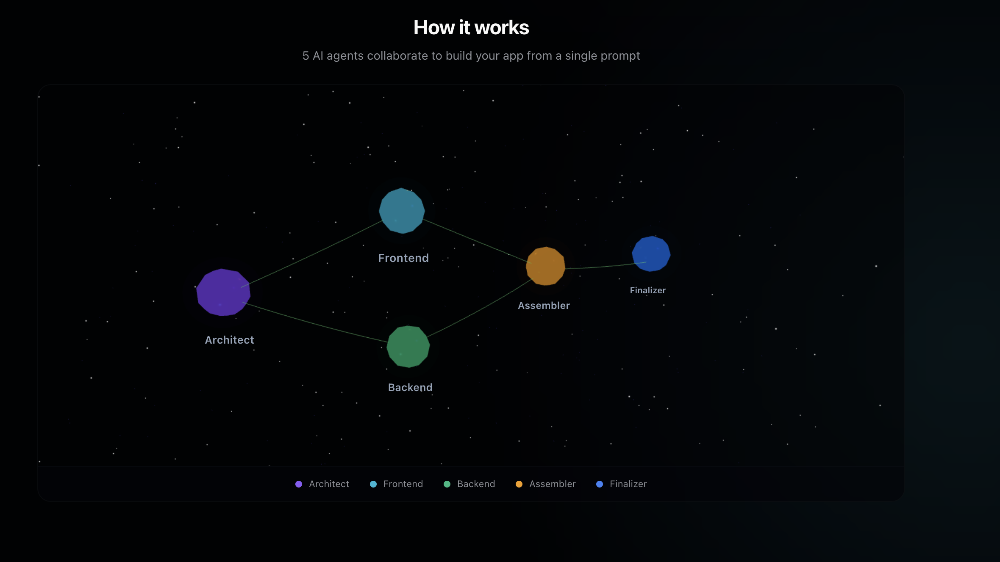
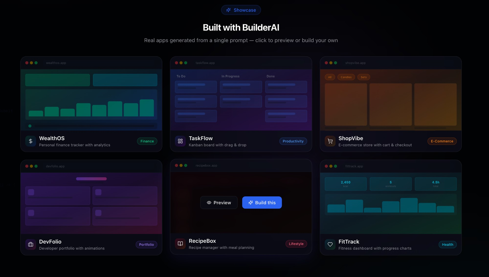
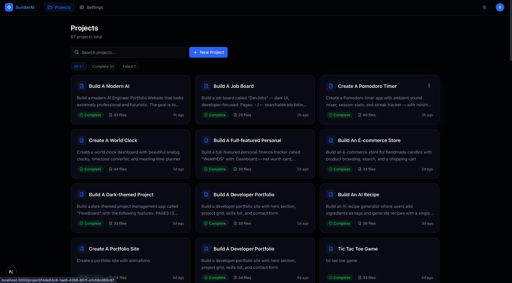

# BuilderAI

> Describe an app in plain English. Get a full-stack, production-ready Next.js project in under 2 minutes.

BuilderAI is an open-source AI app builder powered by a **6-agent LangGraph pipeline**. Type a prompt like *"Build a task manager with auth and dark mode"* and watch as specialized AI agents collaborate in real time to architect, code, integrate, test, and package your app — with a live preview running right in your browser.



---

## Features

### Describe it. Build it. Ship it.

Just type what you want. BuilderAI handles everything — from folder structure to deployment.



### Multi-Agent Pipeline

5 specialized AI agents work together to build your app:

- **Architect** — Designs the app blueprint (pages, components, API routes, database schema)
- **Frontend Agent** — Generates React components, pages, state management, and styling
- **Backend Agent** — Creates API routes, database logic, and server-side code
- **Assembler** — Merges frontend + backend, resolves conflicts, generates configs
- **Finalizer** — Validates the build, packages files, adds README and .env.example

The QA system automatically retries failed agents up to 2 times with targeted feedback.



### Live In-Browser Preview

Your generated app runs instantly inside a **WebContainer** — a full Node.js environment in your browser. No local setup needed. Edit code in the built-in Monaco editor, and changes hot-reload in real time.

### Real-Time Streaming

Watch every agent work in real time via **Server-Sent Events (SSE)**. The pipeline panel shows live status, thinking phases, token usage, and cost per agent.

### Template Gallery

Browse pre-built app templates — finance dashboards, kanban boards, e-commerce stores, portfolios, and more. Click to preview or build instantly.



### Project Management

Manage all your generated projects in one place. Search, filter, and track build status across your entire library.



---

## What You Can Do

| Feature | Description |
|---------|-------------|
| **Build from prompt** | Describe any app and get a complete Next.js project |
| **Live preview** | Apps run in-browser via WebContainer with hot reload |
| **Code editor** | Built-in Monaco editor with syntax highlighting |
| **Quick iterate** | Make changes to existing apps with a single message |
| **Fix errors** | AI auto-detects and fixes build errors |
| **Download ZIP** | Export your project as a ready-to-run ZIP file |
| **Push to GitHub** | Create a repo and push code with one click (OAuth) |
| **Deploy to Vercel** | One-click deployment with framework auto-detection |
| **Version history** | Time-travel through builds, restore any version |
| **Share projects** | Generate public read-only links for your apps |
| **Duplicate projects** | Clone any project with all files and metadata |
| **Model switching** | Choose between Claude Opus, Sonnet, or Haiku per build |
| **Dual LLM mode** | CLI mode (zero API cost) or API mode (pay-per-use) |

---

## Tech Stack

### Frontend
- **Next.js 14** (App Router) + **React 19** + **TypeScript**
- **Tailwind CSS 4** + **shadcn/ui** (Radix primitives)
- **Zustand 5** for state management
- **Monaco Editor** for code editing
- **WebContainer API** for in-browser app execution
- **Framer Motion** for animations
- **Three.js** for 3D pipeline visualization on landing page

### Backend (Agent Service)
- **Python FastAPI** with async SSE streaming
- **LangGraph** for multi-agent orchestration
- **Anthropic SDK** + Claude CLI subprocess support
- **Extended thinking** with configurable token budgets per agent
- Rate limiting (sliding window per IP)

### Database & Auth
- **Supabase** — PostgreSQL with Row-Level Security
- **OAuth** — GitHub + email/password authentication
- **JSONB storage** for generated files, blueprints, and metadata

---

## Multi-Agent Pipeline

```
User Prompt
    |
    v
+-------------+
|  Architect  |  --> App blueprint (pages, components, API, schema)
+------+------+
       |
  +----+----+
  v         v
Frontend  Backend    (run in parallel)
 Agent     Agent
  +----+----+
       |
       v
+-------------+
| Integrator  |  --> Merged files, package.json, configs
+------+------+
       |
       v
+-------------+
|  QA Agent   |---- FAIL --> retry failed agent (max 2x)
+------+------+
       | PASS
       v
+-------------+
|  Packager   |  --> Final project + README + .env.example
+-------------+
```

### Build Modes

- **Full Pipeline** — Complete rebuild from scratch (architect through packager)
- **Quick Iterate** — Lightweight single-agent updates to existing apps (~$0.02-0.10)
- **Fix Mode** — Surgical single-file corrections for specific errors

BuilderAI auto-detects which mode to use based on your message.

---

## Deployment

### One-Click Vercel Deploy

Push your generated app to **Vercel** with a single click:
- Auto-detects framework (Next.js, Vite, static)
- Scans imports and adds missing dependencies
- Uploads all files in parallel
- Tracks deployment URL in project metadata

### GitHub Integration

Push code to **GitHub** with OAuth:
- Creates a new repo with your project name
- Supports public and private repos
- Auto-detects expired tokens and prompts reconnection

### Self-Hosting

| Component | Host | Notes |
|-----------|------|-------|
| Frontend | Vercel | Connect your GitHub repo |
| Agent Service | Railway / Render | Set `ANTHROPIC_API_KEY` |
| Database | Supabase | Already hosted and managed |

---

## Setup

### 1. Clone and install

```bash
git clone https://github.com/rajpatel9595/BuilderAI.git
cd BuilderAI
npm install
```

### 2. Set up Supabase

1. Create a project at [supabase.com](https://supabase.com)
2. Run the migration: `supabase/migrations/001_initial_schema.sql`
3. Enable GitHub OAuth in Authentication > Providers

### 3. Configure environment

```bash
cp .env.example .env.local
```

Fill in your keys:

```
NEXT_PUBLIC_SUPABASE_URL=your_supabase_url
NEXT_PUBLIC_SUPABASE_ANON_KEY=your_anon_key
SUPABASE_SERVICE_ROLE_KEY=your_service_role_key
ANTHROPIC_API_KEY=your_api_key        # Only needed for API mode
AGENT_SERVICE_URL=http://localhost:8000
NEXT_PUBLIC_APP_URL=http://localhost:3000
```

### 4. Start the agent service

```bash
cd agent-service
pip install -r requirements.txt
cp .env.example .env
# Fill in ANTHROPIC_API_KEY
python main.py
```

### 5. Start Next.js

```bash
npm run dev
```

Open [http://localhost:3000](http://localhost:3000) and start building!

---

## LLM Configuration

BuilderAI supports two modes for AI generation:

| Mode | How it works | Cost |
|------|-------------|------|
| **CLI** (default) | Uses Claude Code subscription via subprocess | Free (subscription) |
| **API** | Anthropic SDK with streaming | Pay-per-use |

### Model Options (API mode)

| Model | Speed | Cost per build |
|-------|-------|---------------|
| Claude Opus 4.6 | Slower, highest quality | ~$0.30 - $0.80 |
| Claude Sonnet 4.6 | Balanced | ~$0.10 - $0.30 |
| Claude Haiku 4.5 | Fastest | ~$0.02 - $0.05 |

Switch modes and models in **Settings** or override per-build in the chat.

---

## Project Structure

```
builderai/
+-- app/                    # Next.js App Router
|   +-- (auth)/             # Login, signup, OAuth callback
|   +-- (dashboard)/        # Dashboard, project builder, settings
|   +-- api/                # API routes (chat, deploy, GitHub, iterate, fix)
+-- agent-service/          # Python FastAPI backend
|   +-- agents/             # 6 agent implementations
|   +-- prompts/            # System prompts per agent
|   +-- graph/              # LangGraph pipeline & state
|   +-- utils/              # LLM provider, sanitizer, rate limiter
+-- components/             # React components
|   +-- chat/               # Chat panel, messages, input
|   +-- preview/            # Code editor, WebContainer preview, file tree
|   +-- pipeline/           # Agent status timeline
|   +-- landing/            # Landing page sections
+-- lib/                    # Utilities, stores, Supabase clients
+-- supabase/migrations/    # Database schema (5 migration files)
+-- public/                 # Static assets
```

---

## License

MIT
